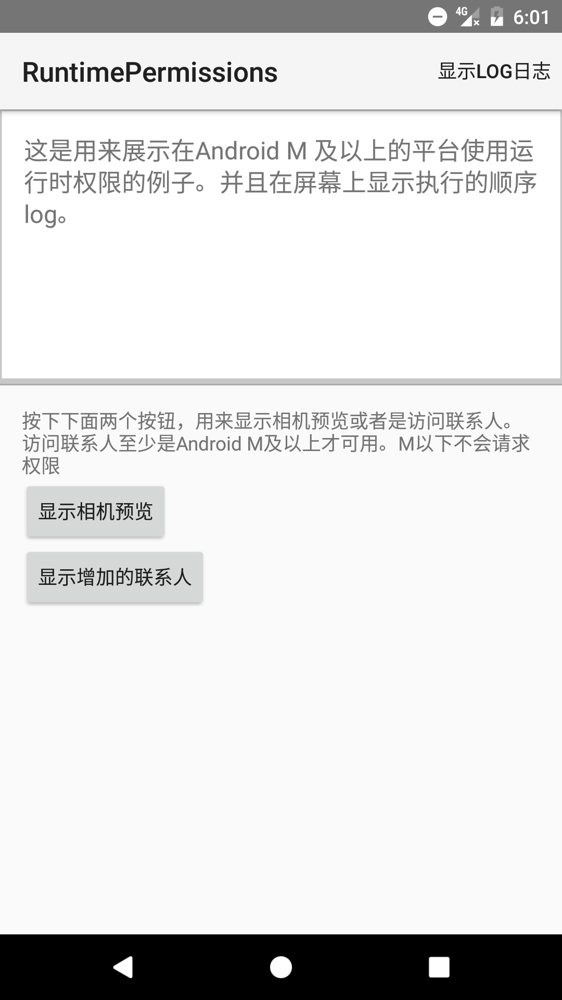
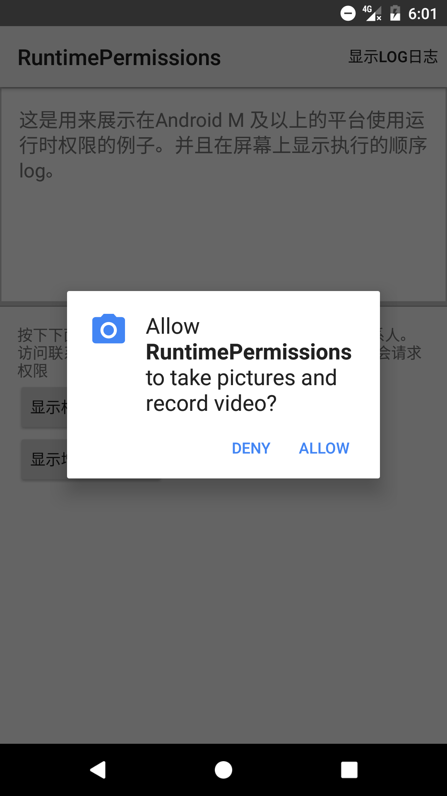
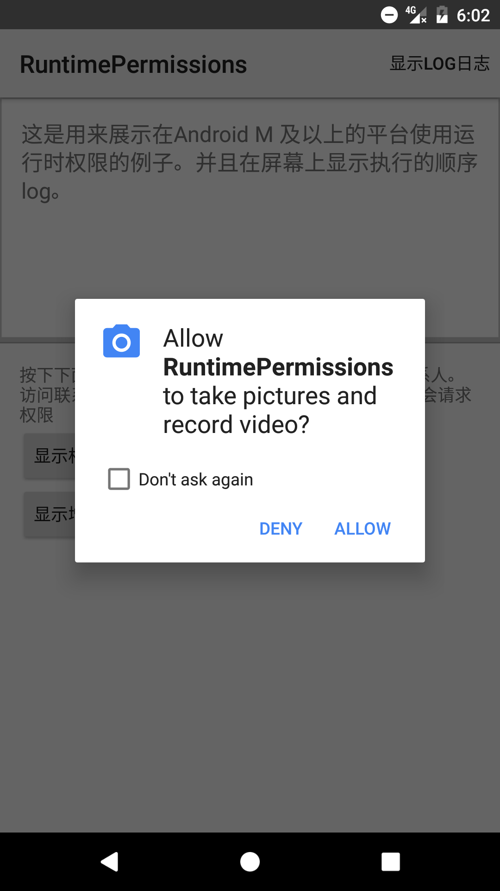

This sample shows runtime permissions available in Android M and above.
It shows how to check and request permissions at runtime, handle backwards compatibility using the
support library and how to declare optional permissions for M-devices only.

Pre-requisites
--------------

- Android SDK 25
- Android Build Tools v25.0.2
- Android Support Repository

Screenshots
-------------

   

Getting Started
---------------

This sample uses the Gradle build system. To build this project, use the
"gradlew build" command or use "Import Project" in Android Studio.

